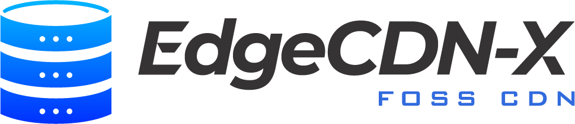

# EdgeCDN-X
Thank you for visiting my page. 

EdgeCDN-X is an open source CDN solution built purely on top of k8s and CNCF projects. 



My plan with this project is to document the progress and create a project which will be easily understandable and deployable by community members.
For updates feel free to sign up to the [newsletter](https://mailing.edgecdnx.com/subscription/form)

Looking for consultation? Set up a free call [here](https://cal.eu/tomas-boros-fbi1fo/30min)

**Demo** Available at [https://portal.demo.edgecdnx.com](https://portal.demo.edgecdnx.com)

**Youtube** Channel at [@edgecdnx](https://www.youtube.com/@edgecdnx)

**Official [Documentation](https://edgecdn-x.github.io/)**

If you're looking for commercial support or consulting services on CDNs, see the **Official [Website](https://edgecdnx.com)**

## Features
EdgeCDN-X is consists of the following components:
* Control-plane - Hosting the UI endpoint and responsible for rolling out the services and configuration via ArgoCD Cluster Generators
* Routing - Routing engine hosts CoreDNS with custom plugins with additional features
* Caching - Caching engine handled via Nginx Ingress controller with customized annotations

## Control-Plane
Control plane is using ArgoCD and custom CRDs and operators to describe the topology, services. This component is using ArgoCD cluster generators to roll out the desired configuration to the individual locations

## Routing
Routing component supports 3 different routing engines:
* DNS Routing - ✅
* 302 Redirection - ✅ 
* URL Rewriting API - ✅ 

NOTE: 302 and URL rewriting API is present in the system, however certificate management is not prepared for such SSL cert generation explostion. With this solution for each `node * location * service` an SSL certificate must be generated, which is currently out of the scope of this project.

Routing component routes the individual requests via the following steps:
* Prefix static routing to individual location (sourced from static prefix list ✅ or BGP 🔜) ✅
* GeoLookup to locations if static routing returns no destination ✅
* Consistent hashing in location to maximize cache-hit ratio. ✅
* Active healthchecks to make sure destinations are healthy and available ✅
* Fallback routing to different location if location has no active nodes ✅
* Caching with multi cache type support. E.g. SSD caching RAMDISK caching ✅

Routing engine is rolled out to each location with **edgecdnx.com/routing** label in the cluster [metadata](https://argo-cd.readthedocs.io/en/stable/operator-manual/applicationset/Generators-Cluster/)

### Static Prefix routing
[edgecdnx-plugin](https://github.com/EdgeCDN-X/edgecdnx-plugin) is a CoreDNS plugin to manage the Routing accross the ecosystem.

It supports:
- Dynamic service-based routing for `A` and `AAAA` queries
- Configurable dynamic answers as `A`/`AAAA` or `CNAME`
- Alternate response mode for gRPC-originated requests detected from incoming context metadata
- Direct node resolution for hostnames in the form `node.location.node.service`
- Prefix-list routing (IP/CIDR to location)
- Geo metadata lookup fallback when no prefix match is found
- Hash-based node selection with health-aware filtering to maximize cache hit/miss ratio for a location
- Fallback locations when a primary location has no healthy node
- Authoritative zone responses for configured Zone CRDs (SOA/NS and related behavior)

## Caching
[edgecdnx-cache](https://github.com/EdgeCDN-X/bootstrap/blob/main/edgecdnx/edgecdnx-cache.yaml) manifest rolls out an NGINX Deamonset for each location specified. Each location is specified as a k8s cluster and cluster definition must be labeled with **edgecdnx.com/caching** label in the cluster [metadata](https://argo-cd.readthedocs.io/en/stable/operator-manual/applicationset/Generators-Cluster/)

The Ingress controller is rolled out as a daemonset. Multiple instances of the caching engine can be rolled out for different caching tiers (e.g., ram, ssd). The underlying storage for caching must be prepared beforehand. To ensure maximum performance the ingress controller is attached to the hostNetwork and mounts the Caches as HostPath Volume. These settings can be modified editing the base manifest.

### Origin Support
We definitely want to support multiple origin types such as, S3 and Static Origins
* Static origins - HTTP, HTTPS based origins - ✅
* S3 Origins - ✅

### Query Parameter whitelisting
Sometimes query params modify the requested content. By default the EdgeCDN-X Platform ignores all query params when building the cache key for the returned content. In order to whitelist these query params we have to specity the queryParams in the cacheKey parameter of the Service Spec:

```yaml
apiVersion: infrastructure.edgecdnx.com/v1alpha1
kind: Service
metadata:
  name: akldjgsofheiwu.cdn.edgecdnx.com
spec:
  name: akldjgsofheiwu.cdn.edgecdnx.com
  domain: akldjgsofheiwu.cdn.edgecdnx.com
  originType: static
  cacheKey:
    queryParams:
      - "v"
      - "ver"
      - "version"
```

This snippet whill ensure, that the requests coming to akldjgsofheiwu.cdn.edgecdnx.com/content.js?ver=1.0.0 and akldjgsofheiwu.cdn.edgecdnx.com/content.js?ver=1.0.1 will be cached individually. If a query param is not defined, it is stripped of when sent to upstream. If no query Param is defined in the cacheKey the query params are passed to the upstream but they're not considered when building the cache key to store the response, which means the requests from the previous response would return the same content.

### SSL Certificate management
This is a bit tricky use case. As per ACME, DNS based certificate issuance can be created for the owned domain (currently edgecdnx.com), we have to solve the challenges of distributing that certificate to the individual endpoints. For customer domains we do not have access to their registrar and NS so we have to fallback to HTTP based challenge. The problem is, that since this is a CDN, the challenge can end up on any of the nodes due to DNS redirection. For this purpose, we will start the challenge on the control plane and build a small helper reverse proxy, which will direct those requests from the individual endpoints to the control plane endpoint where the cert issuance is in progress. Once issued, we have to distribute the Certificates to the individual Endpoints. SSL management work with custom domains and hostAliases too. ✅

### Secure URLS ###
To avoid access to certain objects publicly it is possible to use URL signatures to prevent unauthorized access to the resources. These signatures are often used for signing Stream (HLS or MPEG) playlists. Further down the line, once the signature is verified a session cookie is issued which the client can use to access the stream without having to Sign each segment's request. The session is only valid for a specific stream. Further [reading](https://github.com/EdgeCDN-X/secure-urls) - ✅

# Additional Features
* Multi cache support -  ✅ - Supported, Multiple Nginx definitions have to be defined
* S3 upstream connector -  ✅ - Forked from Nginx and adapted to our needs.
* DNS routing - ✅
* 302 redirection routing - ✅
* Active Healthchecks -  In Progress - ✅
* HostAliases and Bring you own Domain - ✅
* Control plane based on CRDs - v1alpha1 version  ✅
* Controller UI - ✅
* WAF - Web Application Firewall with mod-security ✅

# Additional Features - yet unplanned
* Tiered caching - Edge, local, regional caches to further lower latency and reduce load on origin servers
* Edge caching - Caching on offshore locations, such as boats, trains, remote locations by deploying a cache as an edge computing enpoint
* Large File Support - support for ranges requests and caching to support effective caching of large files
